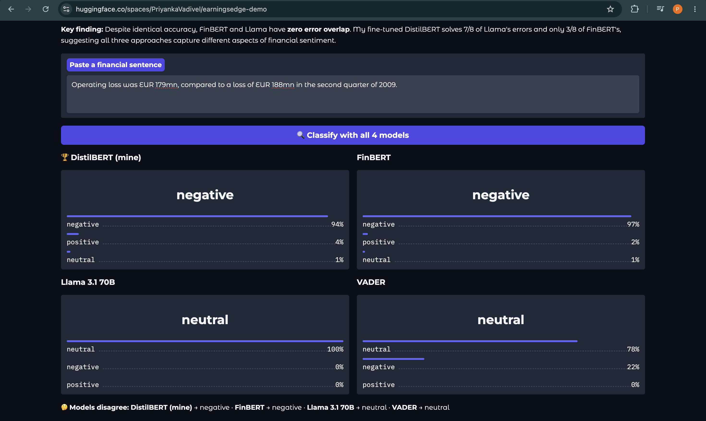
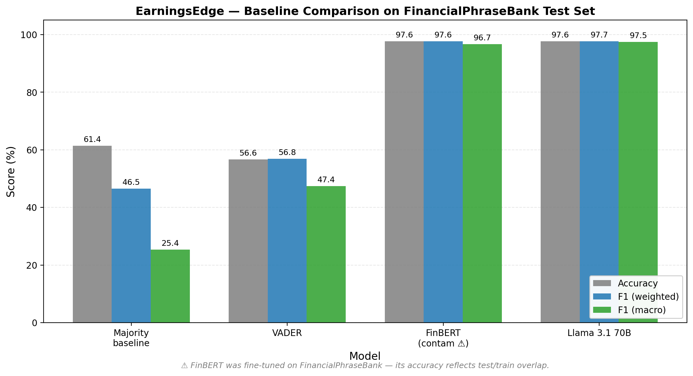
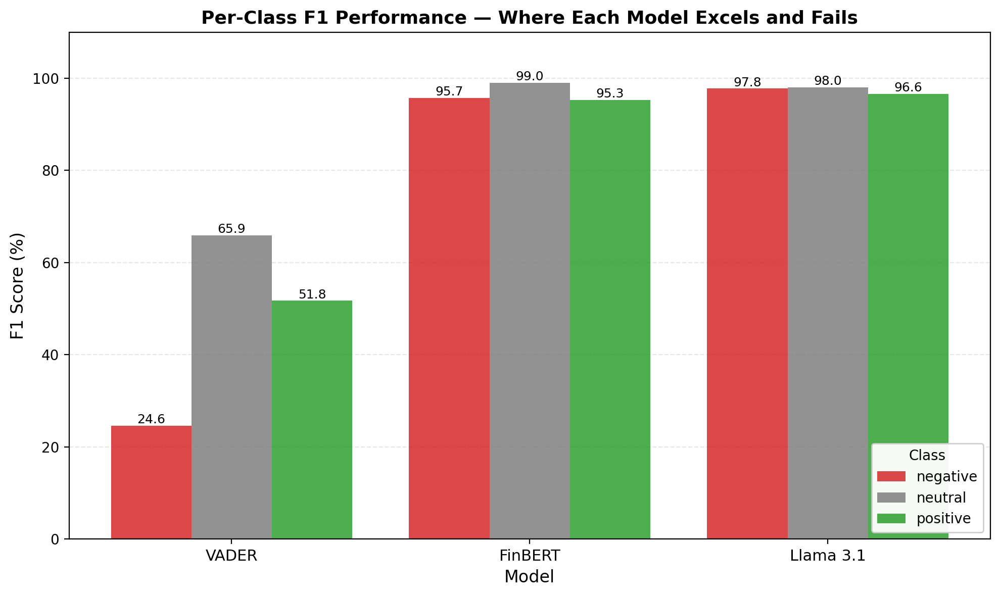
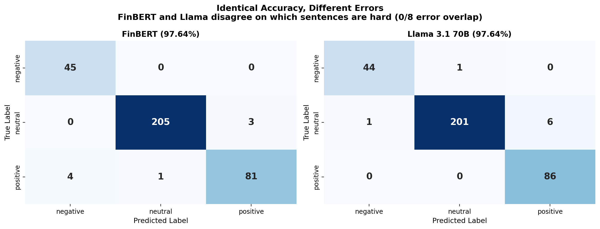

# 📈 EarningsEdge — Financial Sentiment AI

A 66M-parameter fine-tuned DistilBERT that matches a 70B-parameter Llama 3.1 on financial sentiment classification, at 1,000× less inference cost.

**🚀 [Try the live demo](https://huggingface.co/spaces/PriyankaVadivel/earningsedge-demo)** · **🤗 [Model on Hugging Face Hub](https://huggingface.co/PriyankaVadivel/earningsedge-distilbert)** · **📊 [Detailed findings](results/baseline_findings.md)**



*The demo in action: a sentence where "loss decreased year-over-year" is technically positive news, but both BERT-family models confidently predict negative. This kind of arithmetic-reasoning failure is the architectural blind spot the project investigates.*

---

## 🎯 What This Project Is

Most "sentiment analysis" portfolio projects benchmark one model against an off-the-shelf baseline. This one does something more interesting: it **fine-tunes a tiny model from scratch and pits it against three completely different approaches** — a rule-based system from 2014, a domain-specialized BERT, and a 70-billion parameter LLM.

The headline result: my fine-tuned 66M-parameter DistilBERT achieves **96.17% test accuracy**, within 1.5 points of both FinBERT (97.64%, but inflated by train/test contamination) and Llama 3.1 70B (97.64%, zero-shot via Groq API).

But the **more interesting finding is the error analysis** — see below.

---

## 📊 Results

All four models evaluated on the same held-out test set (339 sentences from FinancialPhraseBank):

| Model | Test Accuracy | F1 (weighted) | F1 (macro) | Errors / 339 |
|-------|--------------:|--------------:|-----------:|-------------:|
| Majority baseline | 61.36% | — | — | 131 |
| VADER (rule-based, 2014) | 56.64% | 56.85% | 47.43% | ~147 |
| FinBERT (pre-trained) ⚠️ | 97.64% | 97.65% | 96.69% | 8 |
| Llama 3.1 70B (zero-shot) | 97.64% | 97.65% | 97.49% | 8 |
| **DistilBERT (fine-tuned, mine)** | **96.17%** | **96.13%** | **94.95%** | **13** |

⚠️ FinBERT's accuracy is inflated because FinancialPhraseBank was part of its training data. The "real" number for FinBERT on truly unseen data is unknown.




---

## 🔬 The Key Finding: Three Models, Three Failure Modes

Despite identical accuracy, **FinBERT and Llama have ZERO error overlap.** They fail on completely different sentences.



I extended this analysis to my fine-tuned DistilBERT and found a consistent pattern:

| | Errors solved by DistilBERT | Errors shared with DistilBERT |
|---|---|---|
| FinBERT's 8 errors | 3/8 (37.5%) | 5 |
| Llama's 8 errors | 7/8 (87.5%) | 1 |

**Out of 339 test sentences, only 1 is misclassified by all three high-performing models.**

This breaks down into two distinct DistilBERT failure categories:

**Category A — Shared BERT architectural failures (~6 errors, high confidence):**
DistilBERT confidently fails on the same arithmetic-reasoning cases as FinBERT:
- *"Operating loss was EUR 179mn, compared to a loss of EUR 188mn in 2009"* → predicted negative (conf 94%)
- *"Unit costs for flight operations fell by 6.4 percent"* → predicted negative (conf 96%)

These are structural BERT limits, not data limits. More training data won't fix them.

**Category B — Boundary uncertainty (~7 errors, lower confidence):**
Genuinely ambiguous sentences where the model wisely says "neutral" with low confidence (51–59%).

### Implication: Ensemble would approach 99%+

Three models with different blind spots, near-zero overlap between their errors. A simple majority-vote ensemble could plausibly hit 99%+ accuracy. This is the project's main contribution: empirical evidence that these models are complementary, not redundant.

---

## 🏗️ How It Was Built

**Dataset:** [FinancialPhraseBank](https://huggingface.co/datasets/gtfintechlab/financial_phrasebank_sentences_allagree) — 2,259 expert-labeled financial sentences (after deduping across three annotator-agreement subsets).

**Splits:** 70/15/15 train/val/test, stratified by class. All evaluations on the held-out test set, never seen during training or model selection.

**Pipeline:**
1. **Data:** Loaded FinancialPhraseBank via the `gtfintechlab` HF mirror (the original `takala/financial_phrasebank` loading script broke with Datasets v4+).
2. **Baselines:** VADER (rule-based, lexicon-based), FinBERT (ProsusAI/finbert, pre-trained on financial corpora), Llama 3.1 70B via Groq API (zero-shot with temperature=0).
3. **Fine-tuning:** DistilBERT-base-uncased, 66M params, 3 epochs, batch size 16, learning rate 2e-5, on Apple Silicon MPS. Total training time: 4.5 minutes.
4. **Evaluation:** Per-class precision/recall/F1, confusion matrices, cross-model error overlap analysis.
5. **Deployment:** Live Gradio demo on HF Spaces; model published to HF Hub.

**Tech stack:** Python · PyTorch · Hugging Face Transformers · scikit-learn · Groq API · Gradio · pandas · matplotlib

---

## 📁 Repository Structure
EarningsEdge/

├── app/

│   └── streamlit_app.py        # local Streamlit demo (4-model comparison)

├── data/

│   ├── train.csv, val.csv, test.csv   # stratified 70/15/15 splits

│   └── tokenized/              # HF DatasetDict, ready for training

├── results/

│   ├── baseline_*.json         # metrics for each model

│   ├── baseline_findings.md    # detailed cross-model analysis

│   ├── baseline_comparison.png # bar chart

│   ├── confusion_matrices.png  # FinBERT vs Llama error patterns

│   └── per_class_f1.png        # per-class performance

└── src/

├── load_data.py            # download FinancialPhraseBank

├── prepare_data.py         # tokenize for DistilBERT

├── train_distilbert.py     # fine-tuning script

├── evaluate_distilbert.py  # held-out test evaluation

├── baseline_vader.py

├── baseline_finbert.py

├── baseline_llama.py

├── distilbert_error_analysis.py  # cross-model overlap analysis

└── visualize_baselines.py  # produces the charts

---

## 🔧 Reproduce This

Clone and set up:
```bash
git clone https://github.com/PriyankaVadivel12/EarningsEdge.git
cd EarningsEdge
python -m venv venv && source venv/bin/activate
pip install -r requirements.txt
```

Create a `.env` file with API keys (only Groq is needed for Llama baseline):

HUGGINGFACE_TOKEN=hf_...

GROQ_API_KEY=gsk_...

Run the full pipeline:
```bash
python src/load_data.py              # download & split FinancialPhraseBank
python src/baseline_vader.py         # ~10 sec
python src/baseline_finbert.py       # ~2 min (downloads model)
python src/baseline_llama.py         # ~5 min (Groq API rate limits)
python src/prepare_data.py           # ~30 sec
python src/train_distilbert.py       # ~5 min on Mac MPS
python src/evaluate_distilbert.py    # ~30 sec
python src/distilbert_error_analysis.py  # cross-model comparison
```

Run the local Streamlit demo:
```bash
streamlit run app/streamlit_app.py
```

---

## 💡 What I Learned

- **Fine-tuned small models compete with LLMs on narrow tasks.** A 66M DistilBERT trained for 5 minutes on 1,581 sentences is within 1.5 points of Llama 3.1 70B. The gap closes fast when the task is well-scoped.
- **Architectural limits beat data.** DistilBERT and FinBERT share specific failure modes (arithmetic reasoning, semantic inversion) that aren't solved by more training examples. They're inherent to the BERT architecture.
- **Different models are complementary, not redundant.** Three approaches with ~97% accuracy and three completely different error patterns — that's the basis of a powerful ensemble.
- **Library version drift is the real cost of ML deployment.** Half my engineering hours went to API renames, deprecated parameters, and Python 3.13 compatibility issues — not modeling.

---

## 🙏 Acknowledgments

- **FinancialPhraseBank** by [Malo et al., 2014](https://arxiv.org/abs/1307.5336) — the labeled dataset that makes this benchmark possible.
- **FinBERT** by [Araci, 2019](https://huggingface.co/ProsusAI/finbert) — a strong domain-specialized baseline.
- **Groq** — generous free tier that made Llama 3.1 70B evaluations feasible.
- **Noorul** — my IEEE research mentor whose guidance on rigorous evaluation shaped how I approached this project.

---

## 👤 About

Built by **Priyanka Vadivel**, MS Information Systems @ Northeastern University. Targeting full-time DS/ML roles starting summer 2027.

- 🔗 [LinkedIn](https://www.linkedin.com/in/priyankavadivel)
- 💼 [Portfolio](https://github.com/PriyankaVadivel12)
- 📧 vadivel.p@northeastern.edu

If this project resonates with you and you're hiring for ML/DS roles, I'd love to hear from you.
